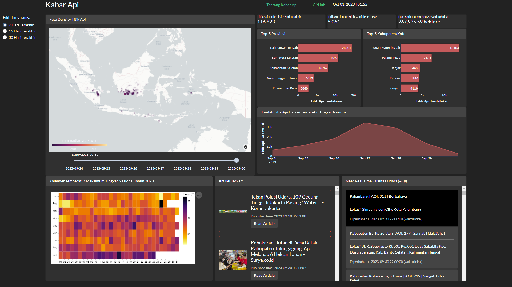

# Indonesia Comprehensive Environmental Monitoring Dashboard

## Overview
The Comprehensive Environmental Monitoring Dashboard is a personal project aimed at building an integrated web application to monitor and visualize active fire hotspots, air quality data, recent news, and statistical information for various provinces and areas in Indonesia. The project aims to provide users with near-real-time insights into environmental conditions and trends.

The dashboard is designed to be informative, user-friendly, and visually appealing, making it a valuable tool for individuals, researchers, and policymakers interested in tracking environmental data and trends related to active fires and air quality.

## Technology Stack
* ETL (Extract, Transform, Load): Python-based ETL stack for fetching, cleaning, and processing data from various sources.
* Database: Utilizing Supabase as the database to store and manage environmental data.
* Web Application: Building a web application using Dash Plotly for interactive and dynamic data visualization.
* Containerization: Considering Docker to containerize the application for easy deployment and scalability.

## Current Status
The project has progressed beyond its early stages, with the ETL pipeline successfully implemented to fetch and process environmental data. Currently, I am in the finishing stage, focusing on enhancing the front-end to make it more visually appealing and user-friendly. Once the user interface is refined, the next steps involve deploying the application and implementing orchestration to ensure seamless operation.